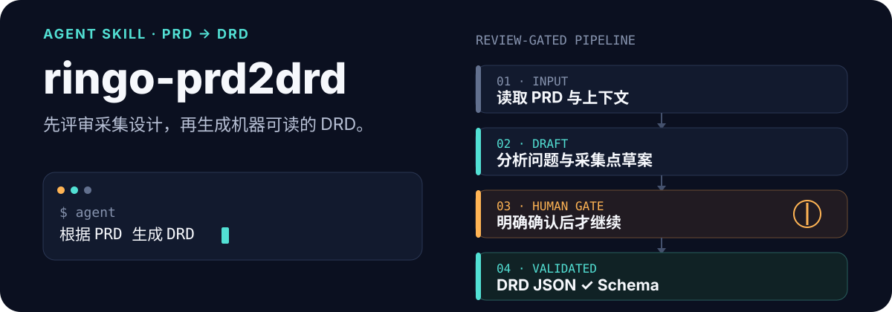
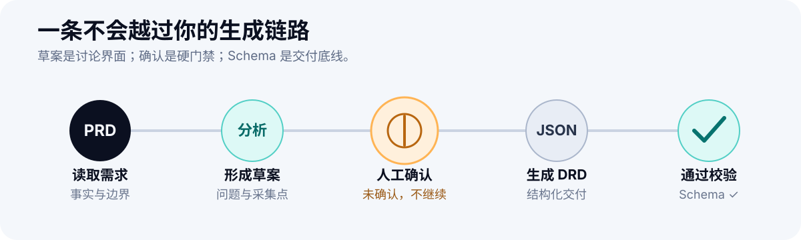

<p align="center">
  
</p>

<p align="center">
  <strong>先把采集设计讲清楚，再把它变成机器可读的 DRD。</strong><br>
  一个带人工确认门禁、隐私边界与 JSON Schema 校验的 Agent Skill 工作流。
</p>

## 最短使用路径

把仓库加入 Agent 的工作目录，提供 PRD 正文或可读取的文件，然后说：

```text
根据 PRD 生成 DRD
```

Agent 会先交付采集点草案并停住。审阅完成后，再明确回复：

```text
采集点确认，可以生成 DRD
```

最终 JSON 默认生成在 `outputs/<requirement>/`，并在交付前通过 Schema 校验。

<p align="center">
  
</p>

## 为什么分成两个阶段

| 设计选择 | 解决的问题 |
| --- | --- |
| 草案先行 | 让业务目标、分析问题和采集点先接受人的判断 |
| 明确确认 | 未得到用户确认时，不生成最终 DRD，也不写外部系统 |
| 证据约束 | PRD 没有提供的事件、属性、平台和负责人统一标记为 `TBD` |
| Schema 校验 | 在交付前检查事件结构、属性类型和必填字段 |
| 本地隐私边界 | 输出、知识库、元数据和私有配置默认不进入 Git |

## 三个 Skill 如何协作

```text
.cursor/skills/
├── prd2drd/       # 总控：读取输入、路由阶段、执行确认门禁
├── prd-analysis/  # 分析：业务目标、指标、漏斗与采集点草案
└── drd-builder/   # 交付：生成 DRD JSON 并执行一致性校验
```

`prd2drd` 负责保持流程边界；`prd-analysis` 只生成可评审草案；`drd-builder` 只有在得到明确确认后才会运行。

## 快速开始

```bash
git clone https://github.com/ringodddd/ringo-prd2drd.git
cd ringo-prd2drd
python3 -m pip install -r requirements.txt
```

如需接入自己的项目系统、文档系统或事件元数据，创建本地配置：

```bash
cp config.example.json config.local.json
```

只在 `config.local.json` 中填写私有路径、地址和标识。它已被 `.gitignore` 排除。

## 校验一份 DRD

```bash
python3 scripts/validate_drd.py outputs/example/example-drd.json
```

校验器读取 [`schemas/drd.schema.json`](./schemas/drd.schema.json)，错误会定位到具体字段；全部通过时返回：

```text
DRD validation passed
```

## 仓库结构

```text
ringo-prd2drd/
├── .cursor/skills/          # 三段式 Agent 工作流
├── assets/readme/           # README 的可编辑 SVG
├── schemas/drd.schema.json  # 通用 DRD JSON Schema
├── scripts/validate_drd.py  # 确定性校验脚本
├── config.example.json      # 无敏感信息的配置模板
└── outputs/                 # 本地生成目录，不进入 Git
```

## 隐私与安全边界

这个公开仓库不会收录真实 PRD、生成结果、过程文件、业务知识库、事件元数据、内部链接、空间标识或账号信息。

提交自己的改动前，建议检查：

```bash
git status --short
git ls-files
```

同时遵守以下边界：

- 不从信息不足的 PRD 中编造事实。
- 未经用户明确确认，不生成最终 DRD。
- 私有知识库仅在本地读取，不复制进仓库。
- 示例只使用虚构数据，不替换成线上真实案例。
